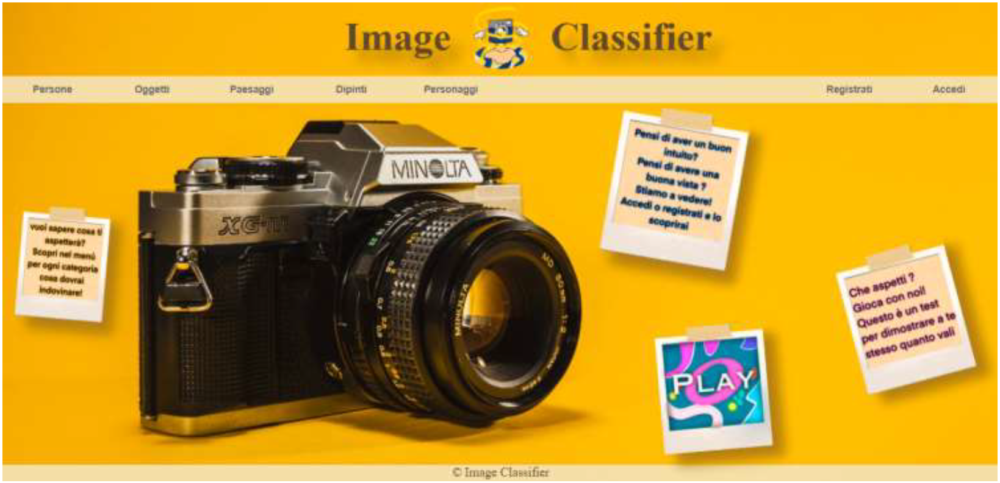
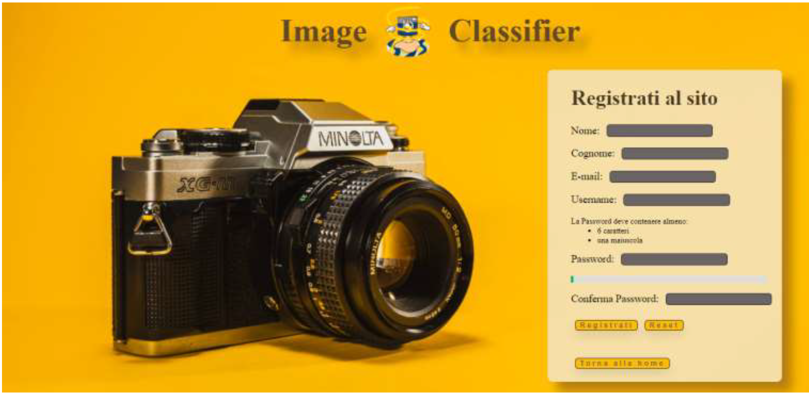
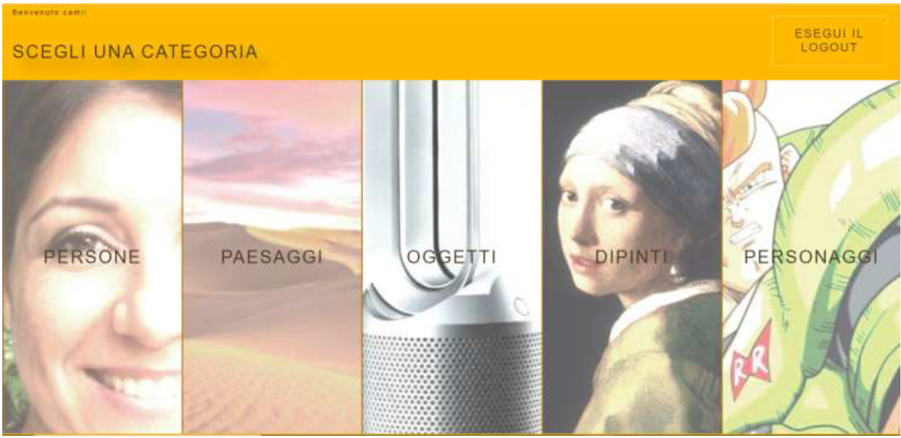
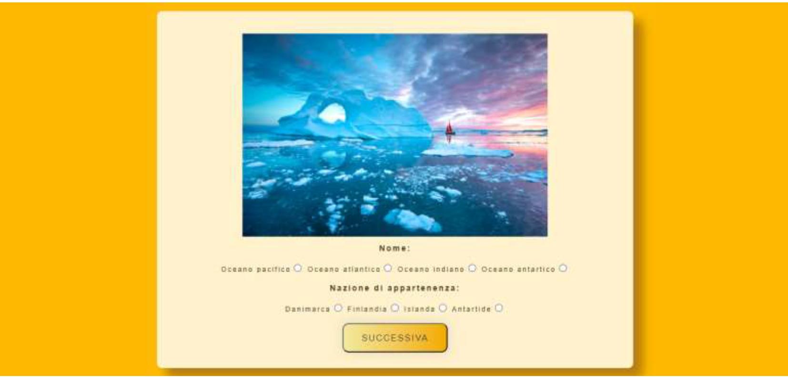
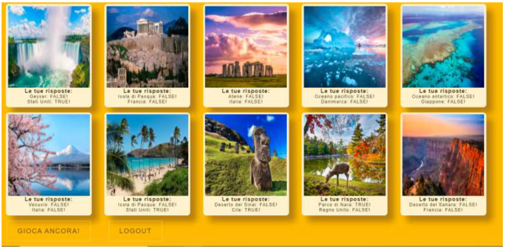

# A web portal for playing image-based quizzes
## Overview
The goal of this project was to create a web portal that allows users to solve some quizzes based on images. Specifically from the images, correctly classified and contained within a database, the user will be able to select a macrocategory from those available (People, Objects, Landscapes, Paintings, and Animated Characters) and guess the categories related to each image shown to him by the system. Specifically, two predefined categories are available for each macrocategory, i.e., for people the age and nationality have been chosen, for objects the name and scope of use, for landscapes the name and country of origin, for paintings the author and style, and finally for animated characters the name and cartoon of reference. Obviously, differentiation had to be ensured in the display offered to the registered and unregistered user. In fact, the latter can only see a page with 10 images, possibly subdivided according to the chosen categories but will not display any further information.

## Developed System
For the development of the system we set as a goal:
- The creation of dynamic web pages with which the user could interact easily and visually pleasing;
- the consistency and security of user's data entered into the database, avoiding access to confidential content while possessing the pages links;
- the proper maintenance of user information during the user's authentication session; 
- the correct validation of client-side input during registration. 
All these aspects were achieved through the application of JavaScript, CSS, HTML and PHP content.
In addition, it was intended to make sure that a "game" experience, granted to the authenticated user, would not be trivial or repetitive, obviously considering the prototypical nature of the product created and the limited number of contents entered in the database. The given structural footprint, which is extremely modular and reusable, allows in any way the possibility of enrichment and extension of the product rather easily and quickly.

## Portal web Structure
- **HomePage**: is the page through which the user can learn what all the macrocategories and related categories are, log in or register, and eventually start playing;
  

    
  

- **Registration page**: is the page through which the user can register for the portal, a check on the data entered and on the robustness of the password will also be carried out for the new user;
  

    
  

- **Page shown to unauthenticated user**: page shown to the unauthenticated user when they try to start the game, contains a number of example images for each macrocategory;
  

    
  

- **Page shown to authenticated user**: page shown to the authenticated user when they try to start the game to choose the macrocategory on which to receive questions;
  

    
  

- **Play page**: page containing the question and the alternatives from which the user can choose;
  

    
  

- **Results page**: page containing the summary of correct and incorrect answers given by the user;
  

    
  

For more details about the pages created, their description, their functionality, and their interconnections, please refer to the [report](Relazione_progetto_TSW.pdf).

## Repository Structure
- `gruppo04/`: contains all the codes and images for the different pages of the portal web, all the images used for the quizzes and stored into the designed database and also the scripts for the database creation;
- `Relazione_progetto_TWS.pdf`: is the report containing details about the pages created, their description, their functionality, and their interconnections.

## Feedback
For any feedback, questions or inquiries, please contact the project maintainers listed in the Contributors section.

